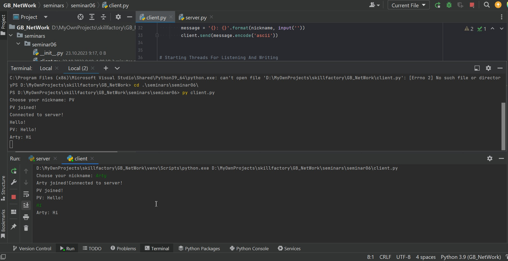
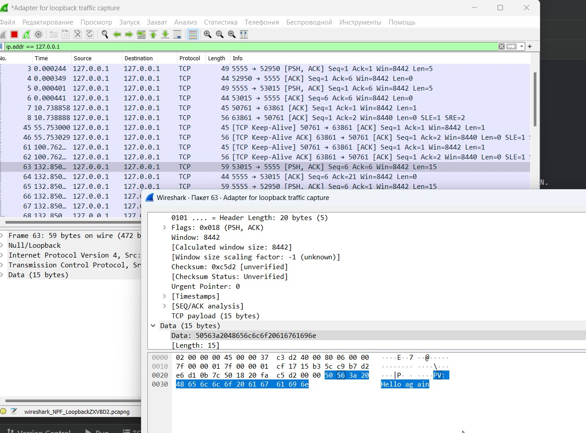

# Компьютерные сети (семинары)
## Урок 6. Основы компьютерных сетей. Транспортный уровень. UDP и TCP.

Напишите свою программу сервер и запустите её. (если опыта в python нет, запустите готовый код и 
разберитесь, как он работает - файл с кодом готового клиента: 

https://disk.yandex.ru/d/cAfsjjG_mLqF3A 

файл с кодом готового сервера: https://disk.yandex.ru/d/qrj4qpiXhXVwgw ) 

'** попробуйте улучшить код, опишите что сделали, какие фичи добавили.

Запустите несколько клиентов. Сымитируйте чат.

Отправьте мне код написанного сервера (можете через github, если удобно или прямо здесь 
в txt формате) и скриншоты работающего чата.

Отследите сокеты с помощью команды netstat. 
(тоже пришлите скриншот именно сокетов вашего чата)

Перехватите трафик своего чата в Wireshark и cшейте сессию. 

Пришлите скриншот сшитой сессии с диалогом.

Посмотрите скринкаст с практикой перед следующим семинаром.

Практика NAT. https://disk.yandex.ru/i/xD314SQzMEF2mA

Практика GRE. https://disk.yandex.ru/i/rhl3uDdyZ1VdjA

Установка OpenVPN. https://disk.yandex.ru/i/fzwkRatuYrsrew

** Заведите себе машину в облаке, будем разбирать как работает VPN. 
Можно yandex cloud (2 мес бесплатно). Можно timeweb.cloud (188 р/мес). 
Или любую другую на ваш выбор

Скрин запущенного чата: 

Скрин перехвата чата при помощи WireShark

